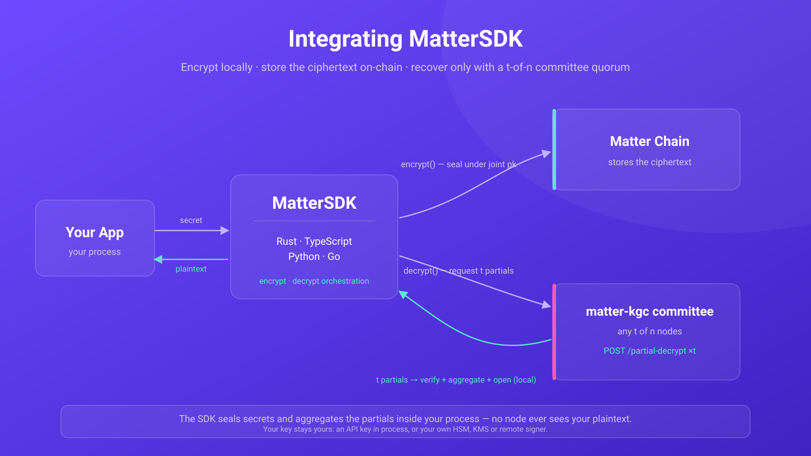
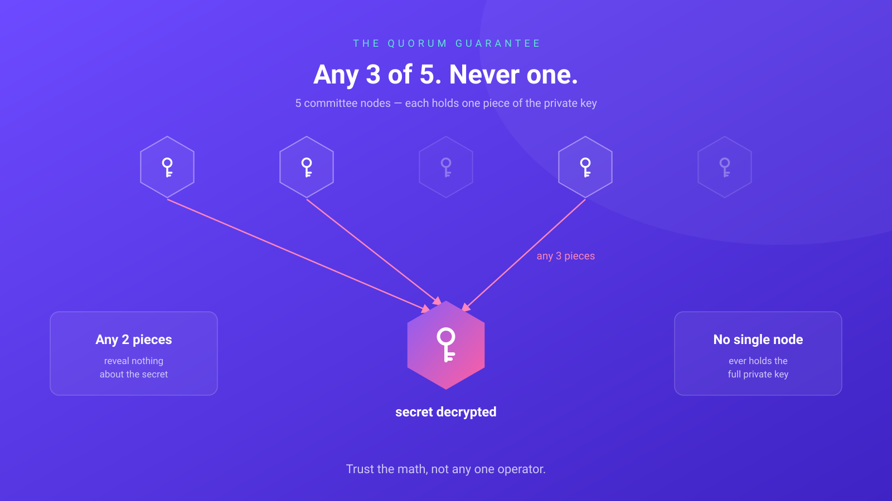
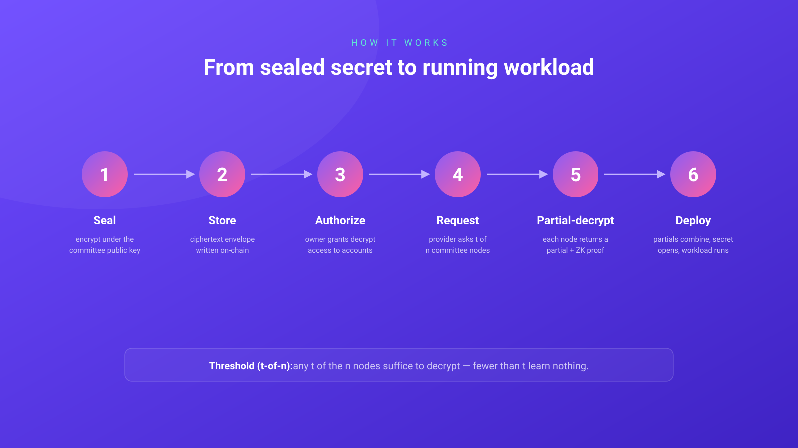

# MatterSDK

**Client SDKs for [OpenMatter](https://openmatter.network) — one `apiKey`, the whole chain, plus threshold secret management on the matter-kgc committee.**

Give the SDK an `apiKey` and you get a client that can do anything that account is
entitled to on MatterChain: request deployments, manage resources, stake, run org
budgets, govern — every pallet the runtime exposes, resolved from live metadata rather
than vendored types.

It also gives you **MatterVault**: seal a secret (API keys, database URLs, env vars)
under a distributed committee's joint public key, store the ciphertext on-chain, and
later **recover it** only with the cooperation of a `t`-of-`n` quorum. No single party —
not even the committee operators — can decrypt your secret alone.

> Status: **early access.** All four bindings — Rust, TypeScript, Python, and Go —
> work end-to-end and have each been verified against the live testnet. See
> [Language support](#language-support) and [`docs/parity.md`](docs/parity.md) for
> exactly what has landed in which language.

<p align="center">
  
</p>

## Why a committee?

A normal secrets manager has a master key — steal it and you have every secret.
MatterVault has **no master key**. The decryption key exists only as Shamir shares
split across `n` independent committee nodes; recovering a secret needs `t` of them
to each compute a *partial decryption* that your client aggregates locally. The
cryptography is RLWE/BGV threshold decryption with zero-knowledge proofs at every
step (implemented in [`matter-crypto`](https://github.com/openmatter-network/matter-crypto));
this SDK is the safe, ergonomic way to use it.

<p align="center">
  
</p>

## Architecture: one core, four shells

The novel cryptography lives in **one** audited Rust crate and is shared by every
language binding through FFI — it is never re-implemented per language (that would
be four chances to get lattice crypto subtly wrong).

| Layer | What it is | Where |
|---|---|---|
| **Crypto core** | Pure, non-networked crypto + wire contract: `encrypt`, `open_secret`, signing payload, Lagrange, proof verify. | `crates/matter-vault-core` |
| **Key core** | API-key ingestion + signing (`ApiKey`, `KeySigner`) — wasm-clean, so every language shares one derivation. | `crates/matter-vault-key` |
| **Rust SDK** | Committee HTTP client, quorum + retry, `Signer`, call builders; the chain client + façades behind the `chain` feature. | `crates/matter-vault` |
| **C ABI** | FFI over the cores; drives the Go binding. | `crates/matter-vault-ffi` |
| **wasm binding** | `wasm-bindgen` over the cores; drives the TS packages. | `bindings/wasm` |
| **TypeScript** | `matter-vault` (seal/recover, zero runtime deps) + `matter-client` (chain client + façades). | `packages/typescript`, `packages/typescript-client` |
| **Python** | PyO3 binding + pure-Python online layer; chain client via the `[sdk]` extra. | `bindings/python` |
| **Go** | cgo over the C ABI + native online layer and chain client. | `packages/go/mattervault` |

Networking, the quorum loop, and **signing** are idiomatic per language; only the
cryptography is shared. A [conformance vector suite](testvectors/) generated from
the core guarantees every binding agrees byte-for-byte. See [`docs/architecture.md`](docs/architecture.md).

## Quickstart

One string in, a working client out. The key is read from the environment — never from
argv or source.

**Your key acts as the member who minted it.** A key minted in the dashboard holds no
authority and no balance of its own: it is a delegate on that member's account, bounded
by the scopes they granted, and the member pays. The client resolves that at connect and
wraps every write accordingly, so nothing about the code below changes either way. See
[Keys and scopes](docs/client-guide.md#keys-and-scopes).

```ts
import { MatterClient, ApiKey, Aad, storeSecret } from "@openmatter-network/matter-client";

const client = await MatterClient.connectWithApiKey(new ApiKey(process.env.MATTER_API_KEY!));

// Any pallet the runtime exposes, resolved from live metadata.
await client.tx("Jobs", "request_deployment", [request]);
await client.tx("Staking", "bond", [client.parseAmount("10"), { Staked: null }]);

// Reads and runtime APIs go through the same surface.
const account = await client.query("System", "Account", [client.accountId]);
const epoch = await client.runtimeApi("KgcApi_dkg_epoch");

// And the MatterVault path, on the same key: seal client-side with `encrypt()`,
// store on-chain. The chain assigns the id in the `Secrets.SecretStored` event;
// recovery is the threshold `decrypt()` — see docs/client-guide.md for the full path.
const receipt = await client.secrets.store(storeSecret(sealed, epoch, "prod", Aad.EnvV1));
```

Defaults are testnet, and a *signing* client refuses to touch mainnet without explicit
confirmation. See [Secure signing](#secure-signing) for what holding a key in-process
does and does not protect against, and [`docs/client-guide.md`](docs/client-guide.md)
for the full surface.

## What the SDK does and does not do

- **Does:** connect to a node, load its metadata, and call **any pallet the runtime
  exposes** — `tx` / `query` / `runtimeApi` / `constant`. Nothing is vendored, so a
  pallet added by a forkless upgrade is reachable without an SDK release. It signs,
  submits, and tracks an extrinsic to finalization.
- **Does:** the whole MatterVault path — seal, orchestrate threshold decryption
  (health-probe → quorum → signed `/partial-decrypt` → verify + aggregate + open) — and
  still builds the `store` / `rotate` / `grant` *call data* if you'd rather submit with
  your own Substrate client.
- **Does not:** decide where your key lives. You choose — a signer you implement over an
  HSM, KMS, or wallet (recommended for production), or an `apiKey` the SDK holds for you
  under documented guardrails. See [Secure signing](#secure-signing).
- **Does not:** hold state, cache secrets, or phone home. It is a stateless client;
  recovered plaintext is returned to you and written nowhere.

## How it works

A secret travels through six steps — sealed client-side, stored as ciphertext, and
recovered only when a `t`-of-`n` quorum cooperates:

<p align="center">
  
</p>

## Language support

All four are at **full parity**: same generic surface, same five façades, same
guards, and matching constructors — with one honest asymmetry: Python's
bring-your-own-key path is `connect_with_keypair` (an in-process
`substrate-interface` keypair), not yet a remote-signer seam like
`connect_with_signer` elsewhere. See [`docs/client-guide.md`](docs/client-guide.md#connecting).

| Language | Seal & recover | `apiKey` | Chain client | Façades | Chain client enabled by |
|---|:--:|:--:|:--:|:--:|---|
| Rust (`matter-vault`) | ✅ | ✅ | ✅ | ✅ | `chain` cargo feature (default off) |
| TypeScript (`@openmatter-network/matter-vault`) | ✅ | ✅ | ✅ | ✅ | `@openmatter-network/matter-client` |
| Python (`matter-vault`) | ✅ | ✅ | ✅ | ✅ | `pip install matter-vault[sdk]` |
| Go (`mattervault`) | ✅ | ✅ | ✅ | ✅ | always (cgo already binds the core) |

The chain client is opt-in in three of the four because it is heavy and not everyone
needs it — a dashboard that only seals secrets in the browser should not pay for
`@polkadot/api`. Parity is enforced rather than claimed: one shared key derivation and
one façade surface, both pinned by fixtures every binding replays. See
[`docs/parity.md`](docs/parity.md).

Per-language guides: [Rust](examples/rust/README.md) ·
[TypeScript](packages/typescript-client/README.md) · [Python](bindings/python/README.md) ·
[Go](packages/go/mattervault/README.md) · [all examples](examples/README.md).

## Secure signing

**You choose where your key lives; the SDK does not choose for you.**

Every operation that needs a signature goes through the same seam: the SDK hands over
the exact canonical bytes and gets back a signature. Provide a `KeySigner` and the key
stays in your HSM, cloud KMS, hardware wallet, or remote signing service, never entering
the SDK's address space. That is the recommended production posture.

For workloads that must build a client from one string — CI jobs, agents, ephemeral
workers — the SDK also accepts an `apiKey` and holds it, inside a container that is
zeroizing, redacted through every formatting path, non-serializable, and refuses to reach
mainnet unconfirmed. Anything that can read the process can still read the key; the trade
is [spelled out plainly](docs/secure-signing.md#what-you-are-trading).

Recovered plaintext is returned in a zeroizing buffer and is never logged.

Read **[`SECURITY.md`](SECURITY.md)** and **[`docs/secure-signing.md`](docs/secure-signing.md)**
before integrating. There are local "load a key from a seed" helpers for examples and
tests — they are named to shame (`..._insecure_dev_only`) and must never ship.

## Security FAQ

Short, practical answers for engineers integrating MatterVault. Each has a **Read
deeper** you can expand.

**Q: Who can actually decrypt my secret?**

Only a **quorum** — `t` of the `n` committee nodes, cooperating. No single node can,
the operators can't, and neither can any group smaller than `t`. Below the threshold
your data is mathematically unrecoverable: there is no master key anywhere to steal.

<details><summary>Read deeper</summary>

The decryption key never exists in one place — it's split into shares, one per node.
Recovering a secret needs `t` nodes to each return a verified *partial decryption*,
which your client checks and combines locally. See [Why a committee?](#why-a-committee).
</details>

**Q: The committee isn't fixed — can it grow, shrink, or swap members?**

Yes. It's a **dynamic `t`-of-`n` group**: nodes can be added or removed and the
threshold can change over time. You don't track who's in it — the SDK reads the live
committee from the chain for you at decrypt time.

**Q: If the committee changes, do I have to re-encrypt my data?**

**No — and this is the part most systems get wrong.** When membership rotates, the
**public key stays the same**. Ciphertext you already stored keeps working unchanged.

```ts
// Encrypt once, today.
const sealed = encrypt(jointPk, epoch, secret, Aad.EnvV1);
await /* store the ciphertext on-chain */ storeSecret(...);

// …months later the committee has rotated members several times…
const plaintext = await decrypt(transport, signer, { /* … */ }); // still just works
```

**Q: How does rotating members make things *more* secure, not less?**

Rotation runs a **proactive refresh**: members periodically replace their shares with
brand-new ones and hand fresh shares to the incoming committee — without the full key
ever being assembled. Old shares become useless. So an attacker who breaks into nodes
slowly, one at a time, is reset at every rotation: they'd have to compromise `t`
members *within a single rotation window* to learn anything. Steal `t-1` shares over a
year and you still have nothing.

For the mechanism — proactive resharing, epoch-stamped ciphertext, and the per-window
compromise model — see [**Key rotation**](docs/architecture.md#key-rotation) in the
architecture doc.

**Q: Is this quantum-safe? How does it line up with NIST's post-quantum standards?**

MatterVault's encryption is **lattice-based** — the same hard-problem family NIST chose
for the post-quantum era (NIST's ML-KEM / FIPS 203 is a close relative). It is designed
to target the **~128-bit, post-quantum security range** NIST aligns to, which means it
resists **"Harvest-Now-Decrypt-Later"**: data an adversary records today cannot be
unsealed by a future quantum computer.

<details><summary>Read deeper</summary>

Unlike a key-exchange primitive such as ML-KEM, MatterVault uses a lattice scheme that
*also* supports threshold decryption — so the post-quantum guarantee and the "no single
key" guarantee come from the same construction. MatterVault is early-access; see
[`SECURITY.md`](SECURITY.md) for the current security posture and assumptions before
relying on it for production secrets.
</details>

**Q: How is this different from a KMS, an HSM, or just encrypting with a key?**

| | Key in your app | KMS / HSM | MatterVault |
|---|---|---|---|
| Where the decryption key lives | one place | one box / one provider | split across `n` nodes; never assembled |
| Single point of compromise | yes | yes | **no** — need `t` nodes at once |
| Who sees plaintext at decrypt time | whoever holds the key | the KMS / HSM | **no one** — nodes return verified partials; your client combines them |
| Survives key-holder rotation without re-encrypting | n/a | usually re-key | **yes** — the public key is stable across membership changes |
| Quantum-safe | depends on cipher | usually classical (RSA / ECC) | **yes** — lattice / post-quantum |

The short version: a KMS still has *a key in a place*. MatterVault has no such place —
and even during decryption, no node ever sees your secret.

## Building from source

The private core crates are pinned as **git-tag dependencies** — `matter-crypto`
`v0.8.1` and `matter-kgc-{proto,config}` `v0.10.0`, fetched over SSH — so you need
a GitHub SSH key with access to the `openmatter-network` repos. (`.cargo/config.toml`
sets `net.git-fetch-with-cli`, so cargo honors your git credentials; CI swaps in an
HTTPS token instead — see `.github/actions/fetch-core-crates`.)

```bash
cargo test -p matter-vault-core   # crypto core + roundtrip
cargo test -p matter-vault        # Rust SDK
```

### Live end-to-end test

Each binding has a live harness that runs the full path — encrypt →
`secrets.storeSecret` → read back → threshold-decrypt — against a real node using a
**funded** account you provide. This is the one path the offline tests can't cover
(that the committee accepts the SDK's signature on-chain):
[Rust](examples/rust-e2e) · [TypeScript](examples/e2e) ([README](examples/e2e/README.md)) ·
[Python](examples/python-e2e) · [Go](examples/go-e2e). They share env vars —
`MATTER_RPC_URL` (defaults to testnet) and `MATTER_SIGNER_SEED` (a funded sr25519 key,
as a `0x`-hex seed or a BIP39 mnemonic; `TEST_KEY` also accepted). A no-gas
[`preflight.ts`](examples/e2e/preflight.ts) checks funding + committee health first.

## License

Apache-2.0 © Open Matter. See [`LICENSE`](LICENSE).
