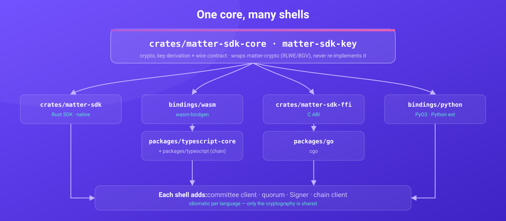
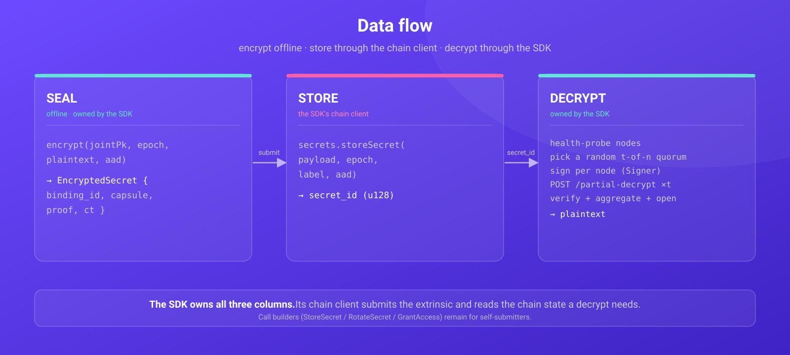
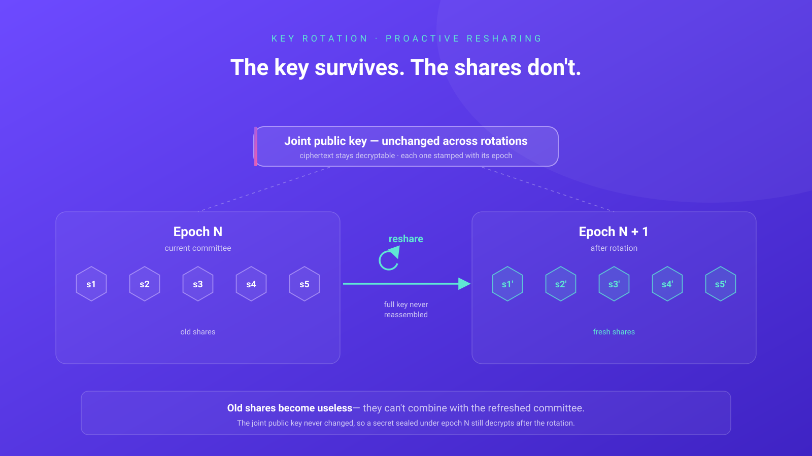
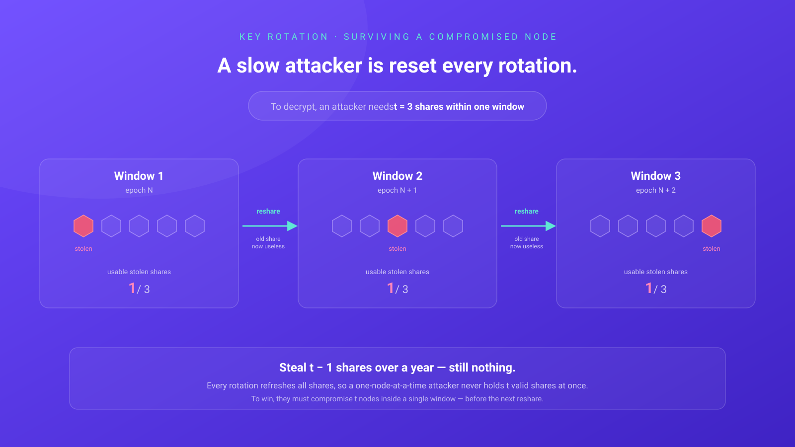

# Architecture

MatterSDK is a polyglot SDK with a single rule: **the cryptography exists once.**

## One core, many shells

  

The **core** does only the cryptography that must never diverge: `encrypt`,
`verifyPlaintextProof`, `lagrangeFor`, the request `signingPayload`, and
`openSecret` (verify → aggregate → AEAD-open). It is pure and synchronous — no
sockets, no async, no key handling — so it compiles unchanged to native, `wasm32`,
and a C ABI.

The **shells** add what is genuinely idiomatic per ecosystem: the HTTP committee
client, quorum selection + retry, the bring-your-own-`Signer` abstraction, and the
on-chain call builders. This is ~300 lines of *non-cryptographic* glue — the same
split the underlying `matter-crypto`/wasm boundary already uses.

### Why not re-implement per language?

Re-porting novel RLWE/BGV lattice cryptography into Python, JS, and Go would be four
chances to get constant-time behaviour, rejection sampling, or transcript binding
subtly wrong — and a classic differential-environment hazard (the "reference in
tests, optimised in prod" trap). One audited implementation, shared by FFI, removes
that entire class of risk.

## Cross-language conformance

Because the bindings share the core, they must agree byte-for-byte. The Rust core
emits fixtures into [`testvectors/`](../testvectors); every binding replays them:

- `signing_payload.json` — the exact request bytes a signer signs.
- `lagrange.json` — the per-node Lagrange coefficient.
- `open_secret.json` — a full sealed secret + committee partials; each binding's
  `openSecret` must recover the known plaintext.

Rust, TypeScript, Python, and Go all pass these today. This is what lets ergonomics
differ while cryptography cannot. The same mechanism now pins three non-cryptographic
contracts as well: seed-format key derivation (`seed_formats.json`), the full API-key
ingestion contract (`api_keys.json`), and the curated façade surface
(`facade_calls.json`).

## Data flow

  

The SDK owns all three columns. The middle one — submitting the extrinsic and reading
chain state (`joint_pk`, `shared_a`, committee roster, per-node share commitments,
threshold) — used to stay with your own Substrate client; the chain client now covers
it, and reaches every other pallet the runtime exposes besides. The call-argument
builders (`StoreSecret`/`RotateSecret`/`GrantAccess`/`RevokeAccess`/`DeleteSecret`)
remain for callers who prefer to submit themselves.

## Key rotation

The committee is a **dynamic `t`-of-`n` group**: members can be added, removed, or
swapped and the threshold can change over time. It keeps its key healthy through
**proactive resharing** — periodically the committee reshares the *same* secret to the
next epoch, handing every node a brand-new share without the full key ever being
reconstructed.

  

The joint public key is tied to the underlying secret, **not** to which nodes hold
shares, so it is **unchanged across rotations**. Each stored ciphertext is stamped with
the **epoch** it was sealed under, so a secret encrypted before a rotation stays
decryptable after it — you never re-encrypt. Resharing advances the committee's epoch;
the SDK reads the live committee state (`joint_pk`, `shared_a`, roster, per-node share
commitments, threshold) from the chain at decrypt time. If a `threshold` of nodes report
a newer `served_epoch` mid-request, the client raises `SdkError::EpochRotated` so the
caller refetches that state and retries — see
[`committee.rs`](../crates/matter-vault/src/committee.rs).

> This is committee-side **key** rotation. It is distinct from the `RotateSecret` call,
> which re-seals *your secret's value* in place under the current epoch — see
> [`calls.rs`](../crates/matter-vault/src/calls.rs).

### Surviving a compromised node

Because a reshare replaces every share, **old shares become useless** the moment a
rotation completes. An attacker who compromises nodes slowly — one at a time — is reset
at every rotation: to recover anything they must hold `t` valid shares *at once*, which
means breaching `t` nodes **within a single rotation window**. Stealing `t-1` shares
spread over a year yields nothing.

  

## Crate / package map

| Path | Role |
|---|---|
| `crates/matter-vault-core` | pure crypto + wire types + AAD registry; the source of truth |
| `crates/matter-vault-key` | API-key ingestion + `KeySigner` — the second pure core, wasm-clean, one derivation for every binding |
| `crates/matter-vault` | Rust SDK: `decrypt`, `Signer`, `calls`; `chain::MatterClient` + façades behind the `chain` feature |
| `crates/matter-vault-ffi` | C ABI over the core (foundation for Go/cgo) |
| `bindings/wasm` | wasm-bindgen binding (drives the TS package) |
| `bindings/python` | PyO3 binding (`matter_vault` extension) |
| `packages/typescript` | TS SDK over the wasm core + orchestration (zero runtime deps) |
| `packages/typescript-client` | TS chain client over `@polkadot/api` |
| `packages/go/mattervault` | Go binding over the C ABI |
| `testvectors/` | conformance fixtures generated by the core |
| `examples/` | offline demos, `client-*` read-only clients, and live e2e harnesses in all four languages |

See [`docs/parity.md`](parity.md) for per-language status and
[`docs/secure-signing.md`](secure-signing.md) for the signing/secret model.
