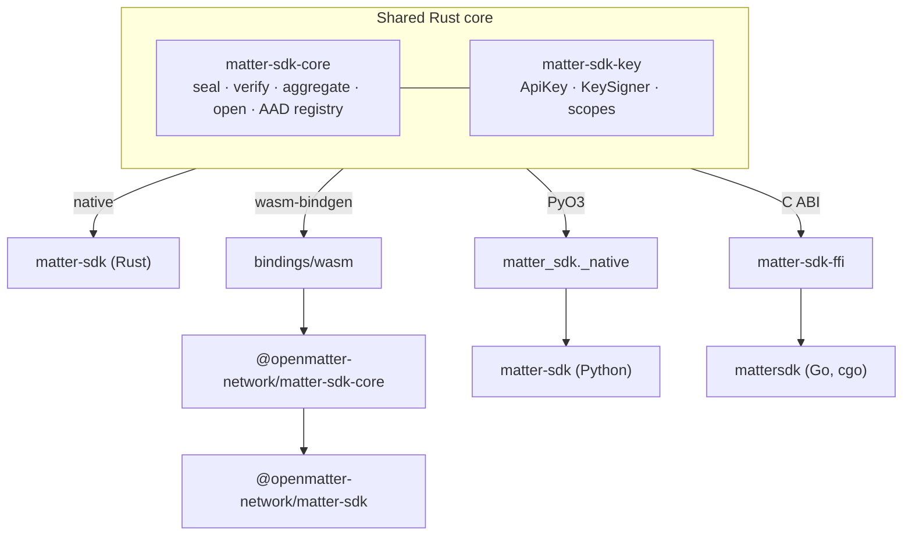

# Architecture

MatterSDK has one Rust core for anything that must never differ between languages
(cryptography and key derivation) and a native shell per language for everything else.
The cryptography exists exactly once.

## The core

`matter-sdk-core` does only the cryptography: `encrypt`, `verify_plaintext_proof`,
`lagrange_for`, the committee request `signing_payload`, and `open_secret` (verify,
aggregate, AEAD-open). It is pure and synchronous, with no sockets, async runtime, or key
handling. That is why it compiles unchanged to native code, `wasm32`, and a C ABI. It
wraps the OpenMatter threshold-cryptography library (RLWE/BGV with zero-knowledge
proofs) and never re-implements it.

`matter-sdk-key` shares API-key parsing, derivation, signing and the scope bitset the
same way, because key derivation is a cross-language contract too. It avoids regex so the
wasm build stays small.

Porting lattice cryptography to four languages would mean four chances to get
constant-time behaviour, rejection sampling, or transcript binding wrong. Every language
calls the core instead.

## The shells

Each language adds, idiomatically:

- the **chain client**: connection, the mainnet guard, generic `tx`/`query`, façades,
  scoped-key delegation, and receipts
- the **committee client**: health probing, random quorum selection, per-node signed
  requests, and fault reporting
- the **signer seams** and the offline **call builders**

| Language | Chain library | HTTP |
|---|---|---|
| Rust | subxt (with the `chain` feature) | reqwest + rustls |
| TypeScript | @polkadot/api (loaded lazily) | `fetch` |
| Python | substrate-interface (with the `[sdk]` extra) | urllib |
| Go | go-substrate-rpc-client (GSRPC) | net/http |

## Cross-language conformance

The Rust core emits JSON fixtures into [`testvectors/`](../testvectors/README.md), and
every language replays them in its own tests. The fixtures cover signing payloads,
Lagrange coefficients, a full sealed secret with real committee partials, key
derivation, scope bits, the scope table, the façade surface, and the default endpoints.
A language that disagrees with a fixture has a bug. Where a contract has only one
consumer, such as Go's hand-built extrinsic layout, that language's unit tests pin it.

## The C ABI

`matter-sdk-ffi` exposes the core and key crates to C (`include/matter_sdk.h`), and Go
links it statically. It fails closed:

- no panic crosses the boundary (`MSDK_ERR_INTERNAL`), and a test checks every exported
  function for this
- out-parameters are cleared on every error path
- `msdk_free` and `msdk_envelope_free` wipe buffers before freeing them
- a null pointer with a non-zero length is an error
- API keys are opaque handles, so key material never crosses the boundary

## Build constraints

- **wasm cannot use the Rust SDK.** reqwest and rustls do not build for
  `wasm32-unknown-unknown`, so `bindings/wasm` depends on the core and key crates only.
  TypeScript implements networking itself.
- **`bindings/wasm` and `bindings/python` are outside the cargo workspace.** wasm-pack
  and maturin build them, so `cargo build --workspace` is native-only.
- **The cryptography library is a private git-tag dependency.** Building from source
  needs read access ([contributing](../CONTRIBUTING.md)). Published npm, PyPI and Go
  packages ship it compiled.
- **The Rust chain client is opt-in.** Without the `chain` feature, `matter-sdk` pulls in
  neither subxt nor tokio.

## Repository map

| Path | Role |
|---|---|
| `crates/matter-sdk-core` | pure crypto, wire types, AAD registry |
| `crates/matter-sdk-key` | `ApiKey`, `KeySigner`, scopes; wasm-clean |
| `crates/matter-sdk` | Rust SDK: committee client, signers, call builders; `chain::MatterClient` and façades behind `chain` |
| `crates/matter-sdk-ffi` | C ABI for Go |
| `bindings/wasm` | wasm-bindgen binding behind the TypeScript core |
| `bindings/python` | the PyO3 extension and the Python package |
| `packages/typescript-core` | `@openmatter-network/matter-sdk-core`: crypto, keys, committee client; no runtime dependencies |
| `packages/typescript` | `@openmatter-network/matter-sdk`: the chain client |
| `packages/go/mattersdk` | the Go package |
| `testvectors/` | conformance fixtures emitted by the core |
| `examples/` | offline demos, read-only clients and live end-to-end harnesses ([examples](../examples/README.md)) |
| `scripts/` | release, packaging and doc guards ([releasing](../RELEASING.md)) |
