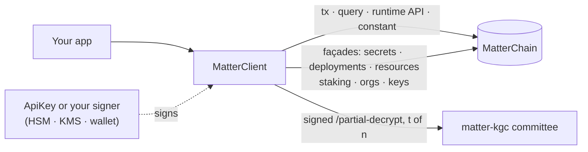
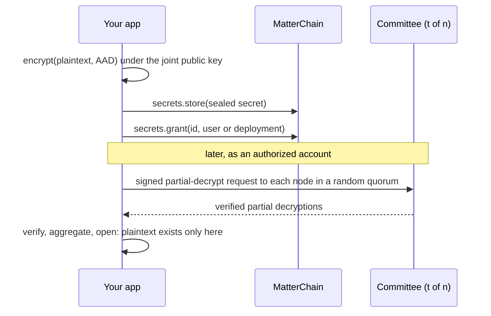

# Concepts

MatterSDK is a client for [OpenMatter](https://openmatter.network). It connects to
MatterChain, signs as your account (or as the member a scoped key acts for), and reaches
every pallet the runtime exposes. It also seals secrets so that only a threshold of
independent committee nodes, working together, can open them.

## Glossary

| Term | Meaning |
|---|---|
| **MatterChain** | OpenMatter's Substrate-based blockchain. Testnet is the default everywhere; mainnet needs [explicit confirmation](connecting.md#the-mainnet-guard) to sign. |
| **Runtime, spec version** | The chain's on-chain program and its version. It upgrades without a fork; features note the spec they need (e.g. scoped keys, spec ≥ 322). |
| **Pallet** | A runtime module, such as `Jobs`, `Secrets`, `Staking` or `Budgets`, reached by name. |
| **Metadata** | The runtime's self-description. The client fetches it at connect and resolves every pallet, call and storage entry against it, so new pallets need no SDK release. |
| **Extrinsic** | A signed transaction. The SDK's writes wait for **finality**, the point after which a block cannot be reverted. |
| **Planck** | The chain's smallest unit. Every SDK amount is an integer number of plancks ([amounts](chain-surface.md#amounts)). |
| **Façade** | A typed wrapper over the generic surface for a common task: [`secrets`](secrets.md), [`deployments`](deployments.md), [`resources`](resources.md), [`staking`](staking.md), [`orgs`](organizations.md), [`keys`](keys-and-scopes.md#minting-keys). |
| **API key** | An sr25519 key from the OpenMatter dashboard, as a hex seed, mnemonic or SURI ([formats](keys-and-scopes.md#api-keys)). |
| **Member, principal** | The organization member a scoped key acts for. Calls run as, and are paid by, the principal. |
| **Scoped key** | An API key a member registered with a set of [scopes](keys-and-scopes.md#scopes) such as `deployments:w`. The runtime enforces the scopes. |
| **KGC committee** | The `n` independent `matter-kgc` nodes that jointly hold the decryption key as shares. None holds the whole key. |
| **Threshold, `t`-of-`n`** | Any `t` committee nodes together can decrypt; fewer than `t` learn nothing. |
| **Epoch** | A committee generation. The committee reshares its key at each rotation; the joint public key stays the same. |
| **Sealed secret** | A secret encrypted under the committee's joint public key and stored on chain. Anyone can read the ciphertext; only a quorum can help open it. |
| **AAD tag** | A label bound into a sealed secret that says what it is for (a deployment env, a TLS key, a volume key…). Seal and open with the same tag ([AAD registry](secrets.md#aad-registry)). |
| **Grant** | Permission, recorded on chain, for a user or a deployment to have a secret decrypted. |

## A secret's lifecycle

The committee never sees the plaintext, and neither does any single node. The details
are in [threshold secrets](secrets.md).

## Where to go next

- Connect and configure: [connecting](connecting.md)
- Call anything on chain: [the chain surface](chain-surface.md)
- Hand a workload a narrow key: [keys and scopes](keys-and-scopes.md)
- Keep keys out of your process: [secure signing](secure-signing.md)
