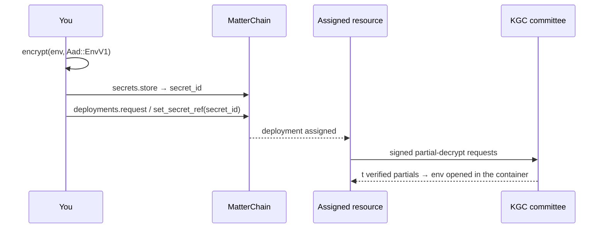

# Deployments

The `deployments` façade drives `pallet-jobs`. Use it to request compute, attach sealed
secrets, set plaintext configuration, and register post-quantum WireGuard peers. It needs a
signing client ([Connecting](connecting.md)). Each method waits for finalization and
returns a [receipt](chain-surface.md#receipts-and-events).

## Methods

| Method | Pallet call | Notes |
|---|---|---|
| `request` | `Jobs.request_deployment` | Takes the runtime's `ResourceRequest` as a value. A scoped key needs `deployments:w`, and `secrets:r` as well if the request sets `secret_ref` or `tls_secret_ref` |
| `cancel` | `Jobs.cancel_deployment` | Scoped key: `deployments:w` |
| `set_secret_ref` | `Jobs.set_deployment_secret_ref` | Point the deployment at a sealed secret, or clear it with `None`. Scoped key: `deployments:w`, plus `secrets:r` unless clearing |
| `set_env` | `Jobs.set_deployment_env` | Sets **plaintext** environment variables. Scoped key: `deployments:w` |
| `register_wg_peer` | `Jobs.register_wg_peer` | Registers a WireGuard peer with a post-quantum preshared key (spec ≥ 330). Scoped key: `networking:w` |

TypeScript camelCases these names (`setSecretRef`) and Go PascalCases them
(`SetSecretRef`). Scope rules come from the runtime; see
[Scoped keys](keys-and-scopes.md#scoped-keys).

```rust
let deployments = client.deployments();
deployments.request(request).await?;                           // a ResourceRequest Value
deployments.set_secret_ref(deployment, Some(secret_id)).await?;
deployments.cancel(deployment).await?;
```

```ts
await client.deployments.request(request);                     // the ResourceRequest object
await client.deployments.setSecretRef(deployment, secretId);   // bigint ids; null clears
await client.deployments.cancel(deployment);
```

```python
client.deployments.request(request)                            # the ResourceRequest dict
client.deployments.set_secret_ref(deployment, secret_id)       # None clears
client.deployments.cancel(deployment)
```

```go
deployment := mattersdk.NewSecretID(42) // u128 ids share the SecretID type
secretID := mattersdk.NewSecretID(7)
if _, err := client.Deployments().SetSecretRef(deployment, &secretID); err != nil { // nil clears
	return err
}
_, err := client.Deployments().Cancel(deployment)
```

## Requesting a deployment

`request` passes the runtime's `ResourceRequest` through unchanged. The SDK does not
mirror the type, so a field the runtime adds in a forkless upgrade needs no SDK
release. Each language uses its own value representation:

| Language | `ResourceRequest` as |
|---|---|
| Rust | `subxt` `Value` (`matter_sdk::chain::Value`) |
| TypeScript | a plain object in `@polkadot/api` form |
| Python | a dict in `substrate-interface` form |
| Go | a go-substrate-rpc-client value, encoded in field order |

All twelve `ResourceRequest` fields are required. Rust encodes the request against
the runtime's metadata and refuses a missing field before anything is signed; in every
language, the runtime rejects a malformed request. The
[QuantumGuard example](#quantumguard-deployments) spells out every field.

## Attaching secrets

Don't put credentials in `set_env`. It writes **plaintext** to chain storage, where
anyone can read it. Seal them instead and give the deployment a reference:



- `secret_ref` carries environment variables sealed under `Aad::EnvV1`. `tls_secret_ref`
  carries TLS-proxy configuration sealed under `Aad::TlsV1`. The full tag list is in the
  [AAD registry](secrets.md#aad-registry).
- A deployment that references a secret gets permission to decrypt it. That is why a
  scoped key needs `secrets:r` as well as `deployments:w` to attach one: sending a
  secret into a container counts as reading it. When the SDK cannot read the request's
  secret fields, it applies the wider requirement.
- Grant or revoke access to a secret directly with the
  [secrets façade](secrets.md#granting-and-revoking).

## Private networking

`register_wg_peer(deployment, pubkey, pq_ciphertext)` registers your WireGuard public key
against a deployment. From runtime spec 330, the tunnel also has a **post-quantum
preshared key**:

1. Read the provider's ML-KEM-768 public key from `OverlayNetworks.PqKemPubkeys`, using
   [`query`](chain-surface.md).
2. Encapsulate to that key. The result is a 1088-byte ciphertext; you keep the shared
   secret.
3. Pass the ciphertext as `pq_ciphertext`. The provider decapsulates it and mixes the
   shared secret into the tunnel as its WireGuard preshared key.

An adversary who records the tunnel's traffic cannot decrypt it later with a quantum
computer, because the preshared key never appears on chain and comes from a lattice KEM.
A scoped key needs `networking:w` for this call, not `deployments:w`.

```rust
client.deployments().register_wg_peer(deployment, wg_pubkey, pq_ciphertext).await?;
```

```ts
await client.deployments.registerWgPeer(deployment, wgPubkey, pqCiphertext); // Uint8Arrays
```

```python
client.deployments.register_wg_peer(deployment, wg_pubkey, pq_ciphertext)  # bytes
```

```go
_, err := client.Deployments().RegisterWgPeer(deployment, wgPubkey, pqCiphertext) // [32]byte, []byte
```

## QuantumGuard deployments

A QuantumGuard deployment (runtime spec ≥ 324) runs an unmodified image under the
QuantumGuard policy engine. The request adds four things to a normal container
request:

- **The engine**, mounted read-only from its own image as a volume.
- **The supervisor as the launcher**, running as user `0`, with the container
  `privileged`.
- **The policy commitment** in `policy_root`.
- **The sealed env** named by `secret_ref`. The guard's key travels only inside it.

The policy envelope's data-encryption key is a separate secret: a raw 32-byte AES-256-GCM
key sealed under `Aad::QuantumGuardPolicyDekV1`, whose id the off-chain envelope names.

```rust
use matter_sdk::chain::Value;

fn quantum_guard_request(treasury: [u8; 32], sealed_env: u128, policy_root: [u8; 32]) -> Value {
    let none = || Value::unnamed_variant("None", []);
    let some = |v: Value| Value::unnamed_variant("Some", [v]);
    let engine = "ghcr.io/openmatter-network/quantum-guard/engine@sha256:…";

    let container = Value::named_composite([
        ("image", Value::from_bytes("nousresearch/hermes-agent")),
        ("tag", Value::from_bytes("latest")),
        (
            "ports",
            some(Value::unnamed_composite([Value::named_composite([
                ("container_port", Value::u128(8089)),
                ("protocol", Value::unnamed_variant("Tcp", [])),
            ])])),
        ),
        // The engine, mounted read-only from its own image.
        (
            "volumes",
            some(Value::unnamed_composite([Value::named_composite([
                ("name", Value::from_bytes("zkfw-engine")),
                ("target", Value::from_bytes("/opt/zkfw")),
                (
                    "source",
                    some(Value::named_variant(
                        "Image",
                        [("reference", Value::from_bytes(engine))],
                    )),
                ),
            ])])),
        ),
        ("command", none()),
        ("privileged", some(Value::bool(true))),
    ]);

    Value::named_composite([
        (
            "config",
            Value::unnamed_variant("ContainerRequest", [container]),
        ),
        ("expiration", none()),
        ("requirements", Value::u128(1)),
        ("treasury", Value::from_bytes(treasury)),
        ("private_resources_only", Value::bool(false)),
        ("allowed_resources", none()),
        ("simple_env_vars", none()),
        ("secret_ref", some(Value::u128(sealed_env))),
        ("tls_secret_ref", none()),
        (
            "launch",
            some(Value::named_composite([
                (
                    "launcher",
                    some(Value::unnamed_composite([Value::from_bytes(
                        "/opt/zkfw/zkfw-sandboxd",
                    )])),
                ),
                ("user", some(Value::from_bytes("0"))),
            ])),
        ),
        ("policy_root", some(Value::from_bytes(policy_root))),
        ("restart_policy", none()),
    ])
}

client.deployments().request(quantum_guard_request(treasury, sealed_env, policy_root)).await?;
```

[`tests/guide_examples.rs`](../crates/matter-sdk/tests/guide_examples.rs) compiles this
function, encodes it against spec-330 metadata, and fails if this page shows different
code.

To change a running deployment's policy or launcher, call the `Jobs` pallet directly
through the [generic surface](chain-surface.md):
`set_deployment_policy_root` and `set_deployment_launch`. A scoped key needs
`deployments:w` for both.

## Other `Jobs` calls

The façade covers the calls most integrations make. You can reach every other `Jobs`
extrinsic, including `set_deployment_image`, `set_deployment_volumes`,
`set_deployment_restart_policy` and `remove_wg_peer`, through
[`tx`](chain-surface.md) by name. Provider-signed calls (`update_deployment_status`,
`set_deployment_network`, `report_tls_status`) return `NeverAdmitted` from a scoped
key; see [Errors](errors.md).
