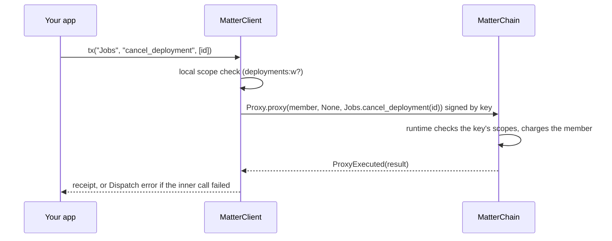

# Keys and scopes

An OpenMatter API key is an sr25519 key that the SDK can sign with. A **scoped key** is
tied to the member who minted it. It acts as that member, the member pays for it, and it
can do only what its scopes allow. This page covers the key formats, how scoped keys
behave, and how to mint and revoke them.

## API keys

`ApiKey` accepts every format the OpenMatter dashboard issues. Leading and trailing
whitespace is ignored.

| Format | Example shape |
|---|---|
| `0x`-prefixed 32-byte mini-secret | `0x9d61…c4a1` |
| BIP39 mnemonic | `abandon abandon … about` |
| sr25519 SURI: a phrase or hex seed with `//hard` or `/soft` junctions and an optional `///password` | `<mnemonic>//org//ci///pass` |

Any of these can carry an explicit `sr25519:` prefix. A key with no prefix is sr25519.
The prefixes `secp256k1:`, `ecdsa:` and `ed25519:` are reserved and report
`UnsupportedScheme`, and any other prefix is refused as malformed without being echoed.
A `:` inside a SURI's password or junction is part of the key, not a prefix. That means an Ethereum-style scheme can be added later without
breaking existing keys.

```rust
use matter_sdk::ApiKey;

let key = ApiKey::parse(&std::env::var("MATTER_API_KEY")?)?;
println!("{}", key.account_id()); // 0x-hex
```

```ts
import { ApiKey } from "@openmatter-network/matter-sdk";

const key = new ApiKey(process.env.MATTER_API_KEY!);
console.log(key.accountIdHex);
key.free(); // wipe the key's wasm memory now, not at GC
```

```python
from matter_sdk import ApiKey, api_key_from_env

key = api_key_from_env()  # MATTER_API_KEY, then MATTER_SIGNER_SEED
print(key.account_id_hex)
```

```go
key, err := mattersdk.NewApiKey(os.Getenv("MATTER_API_KEY"))
if err != nil {
	return err
}
defer key.Close() // wipes the key in the core
```

An `ApiKey` protects itself in every language:

- **It wipes itself.** Rust zeroizes it on drop. TypeScript's `free()`, Python's
  garbage collection and Go's `Close()` wipe the core's copy.
- **It never prints.** `Debug`, `toString`, `toJSON`, `repr`, and Go's `String`/`Format`
  show only the scheme and account. Rust has no `Display` and no `Serialize`. Python
  refuses to pickle or copy it, and Go's `MarshalJSON` returns an error.
- **Errors carry no key material.** A malformed key reports what is wrong, never which
  character or offset.
- **It refuses a SURI with no phrase.** `//Alice` would otherwise derive from the public
  development phrase and give you a globally known key.

Where the key should live in production is covered in [secure signing](secure-signing.md).

## Scoped keys

A scoped key is a member-tied API key. The member registers the key's account on chain
with a set of scopes. From then on:

- **Every call runs as the member.** The SDK wraps each write in
  `Proxy.proxy(member, None, call)`. On chain, the call is the member's.
- **The member pays.** Fees come from the member and their billing organization. The key
  needs no balance.
- **The runtime enforces the scopes.** A call outside the key's scopes is refused on
  chain whatever the SDK does.

The client works out which kind of key it holds when it connects. It asks the runtime
(`BudgetsApi.agent_key`, spec ≥ 322) who the key acts for:

| `Mode` | When | Writes go out as |
|---|---|---|
| `Direct` | the key is not registered as a scoped key (or the runtime predates spec 322) | the key's own account |
| `Delegated { principal, scopes }` | the key is registered | `Proxy.proxy` for `principal` |

Read the result from `mode()` / `principal()` / `scopes()` (Rust), `mode` / `principal` /
`scopes` (TypeScript), `is_delegated` / `principal` / `scopes` (Python), and
`IsDelegated()` / `Principal()` / `Scopes()` (Go). `principal_address` gives the member's
SS58 address.



### Scopes

There are ten scopes, each with independent `r` (read) and `w` (write) access:

`deployments`, `collaborations`, `secrets`, `volumes`, `datasets`, `networking`,
`resources`, `organization`, `billing`, `communities`.

`ScopeSet` parses and prints the text form, e.g. `deployments:rw, secrets:r`. Parsing
is case-insensitive and accepts commas or spaces. Use `ScopeSet::from_str` in Rust,
`ScopeSet.parse` in TypeScript and Python, or `ParseScopeSet` in Go. Sets also expose
`single`, `covering`, `with` (Python `with_`), `union`, `contains`, `is_superset`, and
the raw `bits` the chain stores. Go spells the constructors `SingleScope` and
`CoveringScopes`.

Which scope a call needs:

| Pallet | Calls | Scope |
|---|---|---|
| `Jobs` | deployment lifecycle, env, image, launch, policy root, volumes, restart policy | `deployments:w` |
| `Jobs` | `request_deployment` or `set_deployment_secret_ref` that attaches a secret | `deployments:w` **and** `secrets:r` |
| `Jobs` | `register_wg_peer`, `remove_wg_peer` | `networking:w` |
| `OverlayNetworks` | all | `networking:w` |
| `Secrets` | all | `secrets:w` |
| `Volumes` | all | `volumes:w` |
| `Datasets` | all except the `force_*` calls | `datasets:w` |
| `Collaborations` | all except the root-only setters | `collaborations:w` |
| `Resources` | register, reactivate, suspend, privacy, allow-lists, rename, remove | `resources:w` |
| `Organizations` | members, roles, projects | `organization:w` |
| `Budgets` | `allot`, defund, allotments, member billing and gas limits, project spend caps | `billing:w` |
| `Communities` | all except the `force_*` calls | `communities:w` |

Attaching a secret to a deployment reads the secret, so it needs `secrets:r` as well.
When the SDK cannot read the arguments, it asks for the wider set.

### Calls no key can make

Some calls are **never admitted** to a scoped key, whatever its scopes. The member must
sign them with their own key:

- everything outside the ten pallets above: token transfers, staking, governance, sudo
- the `Proxy`, `Utility` and `EthSigning` pallets, which could otherwise wrap a call to
  escape the check
- provider-signed and root-only calls, such as `Resources.update_sku`,
  `Resources.report_capacity` and `Jobs.update_deployment_status`
- organization lifecycle: `Organizations.create_org` and `delete_org`
- `Budgets` roster and treasury calls, including `authorize_agent_key`,
  `revoke_agent_key` and `authorize_project_secrets_agent`. A key can never mint
  authority for itself or for others.

The complete rule is `required_scopes` in `crates/matter-sdk/src/chain/scopes_table.rs`:
a call it gives no scope set for is never admitted. `NEVER_ADMITTED` there lists the
exclusions inside the ten scoped pallets. Every binding replays the rule from
`testvectors/required_scopes.json`.

### Checked locally first

Before signing anything, a delegated client checks the call against the scope table. It
fails fast with `NotPermitted`, which names the missing scope and the scopes the key
holds, or with `NeverAdmitted`. That turns a node's opaque "Inability to pay some fees"
into "this key lacks `volumes:w`" and spends nothing. The local check is a courtesy; only
the runtime's check is the security boundary.

### When a delegated call fails

The client tells the causes apart instead of passing on a generic pool rejection:

| Error | What happened | What to do |
|---|---|---|
| `NotPermitted` | the call needs a scope the key lacks (checked locally, or after the member re-scoped the key) | have the member widen the key |
| `NeverAdmitted` | no key may make this call | sign with the member's own key |
| `KeyRevoked` | the key's grant is gone or now points at another member, confirmed against the chain | mint a new key |
| `Unsponsored` | the call is in scope, but the member and their billing org cannot cover the fee | fund the member or org |
| `Dispatch` | the proxy call landed but the inner call failed; the error is decoded from `ProxyExecuted` | handle it like any dispatch error |

A revoked key stays in `Delegated` mode. Falling back to `Direct` would turn the next
failure into a confusing fee error. See [errors](errors.md) for each language's spelling.

### Overriding the principal

`MATTER_PRINCIPAL` (hex or SS58) forces the member a key acts for. It skips the chain
lookup and assumes all scopes, so the local check is off and the runtime decides. Use it
only when the chain's pointer is stale but the proxy still stands. The client logs a
warning when it is set.

## Minting keys

The `keys` façade manages scoped keys. `authorize` and `revoke` must be signed by the
member themself, from a `Direct` client; from a delegated client they fail with
`NeverAdmitted`. TypeScript camelCases method names and Go PascalCases them.

| Method | Pallet call | Notes |
|---|---|---|
| `authorize` | `Budgets.authorize_agent_key` | registers `key` with `scopes`; an upsert, so it also re-scopes a live key |
| `revoke` | `Budgets.revoke_agent_key` | ends the key's authority and its committee decrypt rights from the next request on |
| `lookup` | `BudgetsApi.agent_key` (runtime API) | who a key acts for and its scopes, or none; works on a read-only client |

```rust
let scopes: ScopeSet = "deployments:rw, secrets:r".parse()?;
client.keys().authorize(agent, scopes).await?;
let grant = client.keys().lookup(agent).await?; // Option<(AccountId, ScopeSet)>
```

```ts
import { ScopeSet } from "@openmatter-network/matter-sdk";

await client.keys.authorize(agent, ScopeSet.parse("deployments:rw, secrets:r"));
const grant = await client.keys.lookup(agent); // [principal, scopes] | undefined
```

```python
client.keys.authorize(agent, ScopeSet.parse("deployments:rw, secrets:r"))
grant = client.keys.lookup(agent)
```

```go
scopes, err := mattersdk.ParseScopeSet("deployments:rw, secrets:r")
if err != nil {
	return err
}
_, err = client.Keys().Authorize(agent, scopes)
grant, err := client.Keys().Lookup(agent) // *Delegation, nil if unregistered
```

The client also exposes the same lookup as `agent_key` (Rust), `agentKey`
(TypeScript) and `AgentKey` (Go). In Python it is `client.chain.agent_key(key)`, which
returns the raw principal and scope bits. [`examples/delegated-e2e`](../examples/delegated-e2e) connects with a scoped key,
prints its mode, and shows both kinds of local refusal.
