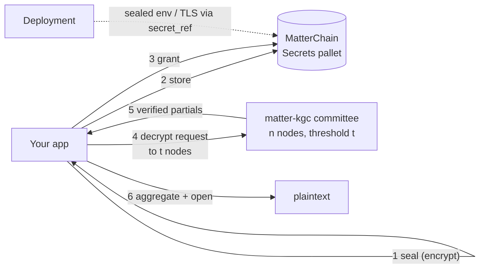
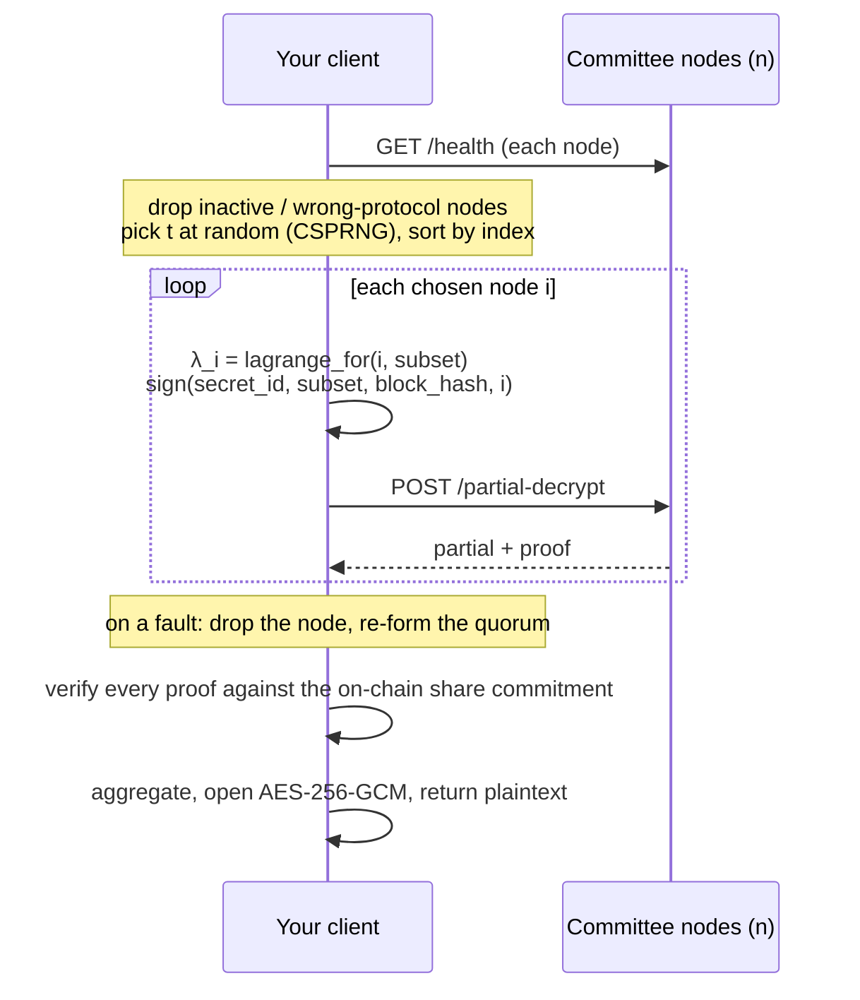
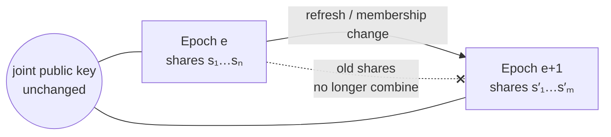

# Threshold secrets

Seal a secret on your machine under the committee's joint public key. Store the ciphertext
on MatterChain and decide who may read it. Recover it only when a `t`-of-`n` quorum of
matter-kgc nodes each contribute a verified partial decryption. No single node holds the
decryption key, and no operator can open your secret alone.



Sealing, verifying, aggregating, and opening all run in one Rust core that every language
shares ([architecture](architecture.md)). Networking and signing are native to each language.

## Sealing

`encrypt` seals plaintext under the committee's joint public key for one epoch and one
[AAD tag](#aad-registry). It returns an `EncryptedSecret` with four fields:

| Field | Contents |
|---|---|
| `binding_id` | Label bound into key derivation and the proof. Pass your own, or leave it out to get 32 random bytes. |
| `capsule` | The BGV-encrypted key seed. Only the committee can open it, jointly. |
| `proof` | A version-tagged zero-knowledge proof that `capsule` is well-formed. |
| `ct` | `nonce(12) ‖ AES-256-GCM(plaintext)`. |

The joint public key and current epoch come from the runtime APIs `KgcApi.joint_pk` and
`KgcApi.dkg_epoch`. Python and Go read them with `ChainClient.joint_pk()` / `dkg_epoch()`
(`JointPk()` / `DkgEpoch()`); Rust and TypeScript use the generic
[`runtime_api`](chain-surface.md).

```rust
use matter_sdk::{encrypt, Aad};

let sealed = encrypt(&joint_pk, epoch, b"DATABASE_URL=postgres://…", Aad::EnvV1.as_bytes(), None)?;
```

```ts
import { encrypt, Aad } from "@openmatter-network/matter-sdk";

const sealed = encrypt(jointPk, epoch, new TextEncoder().encode("DATABASE_URL=…"), Aad.EnvV1);
```

```python
from matter_sdk import encrypt, Aad, aad_bytes

chain = client.chain
sealed = encrypt(chain.joint_pk(), chain.dkg_epoch(), b"DATABASE_URL=...", aad_bytes(Aad.ENV_V1))
```

```go
chain := client.Chain()
jointPk, _ := chain.JointPk()
epoch, _ := chain.DkgEpoch()
sealed, err := mattersdk.Encrypt(jointPk, epoch, []byte("DATABASE_URL=…"), mattersdk.AadBytes(mattersdk.AadEnvV1), nil)
```

Guarantees:

- Empty plaintext is refused.
- Every output field is checked against its on-chain size limit before you submit, so an
  oversized envelope fails locally.
- The seal binds the AAD and the epoch. Opening must present exactly the same values.

## AAD registry

The AAD tag says what a secret is for, and the provider that consumes it checks the tag.
Always use the registry type, never a string you type yourself: a typo then fails when you
compile, not when you open. Tags are append-only. A breaking change gets a new `/v2` tag.

| Tag (Rust / TS · Python · Go) | Bytes | Payload |
|---|---|---|
| `EnvV1` · `ENV_V1` · `AadEnvV1` | `matter-deployment/env/v1` | Deployment environment variables, as `KEY=VALUE` lines. |
| `TlsV1` · `TLS_V1` · `AadTlsV1` | `matter-deployment/tls/v1` | TLS-terminating-proxy configuration. |
| `StorageCredsV1` · `STORAGE_CREDS_V1` · `AadStorageCredsV1` | `matter-volume/storage-creds/v1` | Object-storage credentials for a persistent volume. |
| `VolumeDekV1` · `VOLUME_DEK_V1` · `AadVolumeDekV1` | `matter-volume/dek/v1` | A persistent volume's data-encryption key. |
| `DatasetSourceCredsV1` · `DATASET_SOURCE_CREDS_V1` · `AadDatasetSourceCredsV1` | `matter-dataset/source-creds/v1` | Dataset source credentials for a data-ingest agent (schema below). |
| `QuantumGuardPolicyDekV1` · `QUANTUM_GUARD_POLICY_DEK_V1` · `AadQuantumGuardPolicyDekV1` | `quantum-guard/policy-dek/v1` | The raw 32-byte AES-256-GCM key for a deployment's [QuantumGuard](deployments.md) policy envelope. |

`DatasetSourceCredsV1` carries UTF-8 JSON, told apart by `"kind"`. Consumers ignore
fields they don't know.

```json
{ "kind": "s3",
  "bucket_name": "…", "region": "…", "object_key": "…",
  "access_key_id": "…", "secret_access_key": "…" }

{ "kind": "postgres",
  "host": "…", "port": 5432, "database": "…",
  "username": "…", "password": "…",
  "table_name": "…", "ssl_enabled": true }
```

## The `secrets` façade

The `secrets` façade covers every call in the `Secrets` pallet. The table uses Rust names;
TypeScript camelCases them and Go PascalCases them.

| Method | Pallet call | Notes |
|---|---|---|
| `store` | `Secrets.store_secret` | Publish a sealed envelope with its epoch, a label, and its AAD tag. The chain assigns the id. |
| `rotate` | `Secrets.rotate_secret` | Re-seal an existing secret in place under the current epoch. |
| `grant` | `Secrets.grant_access` | Authorize a `GrantTarget`. Rust also has `grant_to_user` and `grant_to_deployment`. |
| `revoke` | `Secrets.revoke_access` | Withdraw a grant. The target must match the grant **exactly**, or nothing changes on chain. |
| `delete` | `Secrets.delete_secret` | Delete the secret and every grant on it. Owner only, and it cannot be undone. |
| `recover` | — (reads only) | Rust only: read, assemble the committee, and threshold-decrypt in one call. See [Recovering](#recovering). |

Writes return a receipt once the block is **finalized**, because the committee authorizes
against the finalized head ([receipts](chain-surface.md#receipts-and-events)). A
[scoped key](keys-and-scopes.md#scoped-keys) needs `secrets:w` to write. Decrypting as its
member needs `secrets:r`.

### Storing, and reading back the id

```rust
use matter_sdk::{Aad, StoreSecret};

let receipt = client
    .secrets()
    .store(&StoreSecret::new(sealed, epoch, "db-url", Aad::EnvV1))
    .await?;
// The id is field 0 of `Secrets.SecretStored`; read it from the block's events via `client.subxt()`.
```

```ts
import { storeSecret, Aad } from "@openmatter-network/matter-sdk";

const receipt = await client.secrets.store(storeSecret(sealed, epoch, "db-url", Aad.EnvV1));
```

```python
receipt = client.secrets.store(sealed, epoch, "db-url", Aad.ENV_V1)
stored = receipt.require_event("Secrets", "SecretStored")  # {secret_id, owner}
```

```go
receipt, err := client.Secrets().Store(*sealed, epoch, "db-url", mattersdk.AadEnvV1)
for _, e := range receipt.Events {
	if e.Pallet == "Secrets" && e.Name == "SecretStored" {
		secretID, err = mattersdk.SecretIDFromEvent(e)
	}
}
```

Only Python and Go receipts carry event fields. In Rust and TypeScript, read the
`SecretStored` event at `receipt.block_hash` through the underlying client
([parity](parity.md)). Never predict the id from a counter: two concurrent stores would
each read the other's id.

### Granting and revoking

A grant names who may request decryption:

| `GrantTarget` | Meaning |
|---|---|
| `User(account)` | A 32-byte account may request partials directly. |
| `Deployment(id)` | Whichever resource is currently running that deployment may request partials, so the grant follows the deployment when it moves to another provider. |

```rust
use matter_sdk::GrantTarget;

client.secrets().grant_to_deployment(secret_id, deployment_id).await?;
client.secrets().revoke(secret_id, &GrantTarget::User(account)).await?;
```

```ts
import { grantToDeployment, grantToUser } from "@openmatter-network/matter-sdk";

await client.secrets.grant(secretId, grantToDeployment(deploymentId));
await client.secrets.revoke(secretId, grantToUser(account));
```

```python
from matter_sdk.calls import grant_to_deployment, grant_to_user

client.secrets.grant(secret_id, grant_to_deployment(deployment_id))
client.secrets.revoke(secret_id, grant_to_user(account))
```

```go
client.Secrets().Grant(secretID, mattersdk.DeploymentTarget(deploymentID))
target, _ := mattersdk.UserTarget(account)
client.Secrets().Revoke(secretID, target)
```

To hand a sealed environment to a workload, point its deployment at the secret with
`set_secret_ref` ([deployments](deployments.md)) and grant the secret to that deployment.

### Rotating and deleting

`rotate` re-seals a secret under the current epoch and keeps the same id and grants. You
never *need* it for committee changes, because the joint key is stable across them
([key rotation](#committee-key-rotation)). Use it to change the plaintext. `delete` removes
the secret and all its grants for good.

## Recovering

The owner, a `User` grantee, the resource running a granted deployment, a project
secrets agent ([organizations](organizations.md)), or a scoped key holding `secrets:r`
for the owner can recover. The committee checks the requester against the chain before it serves a partial.

**Rust** does it in one call. `recover` reads the envelope, epoch, and recorded AAD. It
refuses a mismatched tag *before contacting any node* (`AadMismatch`). Then it assembles
that epoch's committee from `KgcApi` and threshold-decrypts with the client's key:

```rust
let plaintext = client.secrets().recover(secret_id, Aad::EnvV1).await?;
use_it(plaintext.expose());
```

**TypeScript, Python, and Go** expose the same steps as primitives. Read the secret's
payload and epoch and the committee **at that epoch**, then call `decrypt`. Every piece of
committee state (`shared_a`, threshold, members, share commitments) must belong to the
epoch the secret was sealed under. Python's `client.chain.committee_at(epoch)` and Go's
`client.Chain().CommitteeAt(epoch)` read all of it in one call, exactly as Rust's
`recover` does; the payload comes from `secret_payload` / `SecretPayload`. The complete working version is in each
language's end-to-end example ([examples](../examples/README.md)). Rust callers with their
own Substrate client use `recover_secret` with a `CommitteeInfo`.

```ts
import { decrypt, FetchTransport, keySigner } from "@openmatter-network/matter-sdk";

const plaintext = await decrypt(new FetchTransport(), keySigner(client.signer!), {
  secretId, epoch, bindingId, aad: Aad.EnvV1, capsule, ct, sharedA, blockHash, threshold, nodes,
});
```

```python
from matter_sdk import decrypt, DecryptParams, UrllibTransport

committee = client.chain.committee_at(epoch)
plaintext = decrypt(UrllibTransport(), client.signer(), DecryptParams(
    secret_id=secret_id, epoch=epoch, binding_id=binding_id, aad=Aad.ENV_V1,
    capsule=capsule, ct=ct, shared_a=committee.shared_a, block_hash=committee.block_hash,
    threshold=committee.threshold, nodes=committee.nodes))
```

```go
committee, err := client.Chain().CommitteeAt(epoch)
if err != nil {
	return err
}
signer, _ := client.Signer()
plaintext, err := mattersdk.Decrypt(mattersdk.NewHTTPTransport(), signer, mattersdk.DecryptParams{
	SecretID: secretID, Epoch: epoch, BindingID: env.BindingID, Aad: mattersdk.AadEnvV1,
	Capsule: env.Capsule, CT: env.CT, SharedA: committee.SharedA, BlockHash: committee.BlockHash,
	Threshold: committee.Threshold, Nodes: committee.Nodes,
})
```

## How decrypt works



- **The quorum is random.** Each decrypt draws `t` of the healthy nodes uniformly at random.
  No single node sees every request, and none can block every request.
- **Each signature is bound to one node.** A request signature covers
  `(secret_id, subset, block_hash, recipient_index)`. A captured request can't be aimed at
  another secret, replayed after its freshness window, or forwarded to a peer to collect a
  quorum.
- **Proofs are checked against the chain.** Every partial is verified against the share
  commitment read from MatterChain, never one a node supplies. The client derives each
  Lagrange coefficient itself and rejects a repeated or zero index.
- **Faults are named.** Each dropped node is reported with its index, endpoint, and stage:
  `health`, `inactive`, `partial-decrypt`, `epoch-mismatch`, or `protocol-version`
  (Rust `FaultStage::Health` … `ProtocolVersion`). If too few nodes remain, you get
  `QuorumUnavailable` with the whole list ([errors](errors.md)).
- **Epoch rotation is a vote.** If `t` nodes serve the same newer epoch, decrypt returns
  `EpochRotated`: fetch the committee state again and retry. A single node serving a
  different epoch is just a fault.
- **Every request is bounded.** Responses are capped at `MAX_COMMITTEE_RESPONSE_BYTES`
  (1 GiB) and enforced while reading, and every request has a deadline. The transports are
  Rust `ReqwestTransport` (bring your own client with `with_client`), TypeScript
  `FetchTransport` (`timeoutMs`), Python `UrllibTransport` (`timeout`) and Go
  `HTTPTransport`. Their default timeouts differ ([parity](parity.md)).

## Committee key rotation

The committee is a dynamic `t`-of-`n` group. When members join or leave, the remaining
nodes refresh their shares, and the **joint public key stays the same**. Stored ciphertext
keeps decrypting without re-encryption, and shares from before the refresh no longer
combine with the new ones.



A secret records the epoch it was sealed under. Decrypt reads that epoch's threshold and
share commitments, so an old secret opens after any number of rotations.

## Handling plaintext

Recovered plaintext is never logged and never written anywhere by the SDK.

| Language | What you get | Wiping |
|---|---|---|
| Rust | `Plaintext`: a zeroizing buffer. Its `Debug` is redacted and it has no `Display`. | Automatic on drop. Read through `expose()` only where you use it. |
| TypeScript | `Uint8Array` | `wipe(bytes)` |
| Python | `bytearray` | `matter_sdk.wipe(buf)` |
| Go | `[]byte` | `mattersdk.Wipe(b)` |

The core wipes its own copies before it frees them. In TypeScript, Python, and Go, wipe
yours as soon as you're done with it.

## Without the chain client

The secrets path doesn't depend on the chain client. If you submit with your own Substrate
client, the call builders give you exact `Secrets` call arguments. Each takes an `Aad` tag,
so a secret can't be stored under a different AAD than it was sealed with.

| Language | Builders |
|---|---|
| Rust (no `chain` feature needed) | `StoreSecret::new`, `RotateSecret::new`, `GrantAccess::to_user` / `to_deployment`, `RevokeAccess::from_user` / `from_deployment`, `DeleteSecret::new`; `StoreSecret::to_values()` with `chain` |
| TypeScript (`matter-sdk-core`) | `storeSecret`, `rotateSecret`, `grantAccess`, `revokeAccess`, `deleteSecret`, `grantToUser`, `grantToDeployment` |
| Python (`matter_sdk.calls`) | `store_secret`, `rotate_secret`, `grant_access`, `revoke_access`, `delete_secret`, `grant_to_user`, `grant_to_deployment` (substrate-interface `call_params`) |
| Go (`ChainClient`) | `StoreSecretCall`, `RotateSecretCall`, `GrantAccessCall`, `RevokeAccessCall`, `DeleteSecretCall` |

The committee client is also separate from the transport. Implement `Transport` (health
and partial-decrypt) to run the whole quorum flow against an in-process committee in
tests. The `rust` and `typescript` [examples](../examples/README.md) do exactly this.

## Crypto primitives

These are the building blocks under `decrypt`, for callers running their own committee
orchestration. All of them are the shared Rust core. Bindings wrap it and never
reimplement it.

| Operation | Rust | TypeScript | Python | Go |
|---|---|---|---|---|
| Seal | `encrypt` | `encrypt` | `encrypt` | `Encrypt` |
| Bytes a requester signs for one node | `signing_payload` | `signingPayload` | `signing_payload` | `SigningPayload` |
| Lagrange coefficient for a point in a subset | `lagrange_for` | `lagrangeFor` | `lagrange_for` | `LagrangeFor` |
| Check an envelope's proof before contacting any node | `verify_plaintext_proof` | `verifyPlaintextProof` | `verify_plaintext_proof` | `VerifyPlaintextProof` |
| Verify partials, aggregate, and open | `open_secret` | `openSecret` | `open_secret` | `OpenSecret` |
| Protocol version | `CRYPTO_PROTOCOL_VERSION` | `cryptoProtocolVersion()` | `CRYPTO_PROTOCOL_VERSION` | `CryptoProtocolVersion()` |
| Committee response cap | `MAX_COMMITTEE_RESPONSE_BYTES` | `maxCommitteeResponseBytes()` | `MAX_COMMITTEE_RESPONSE_BYTES` | `MaxCommitteeResponseBytes()` |

`open_secret` checks the subset first: points must be non-empty, non-zero, and distinct.
It decodes every input strictly, with size bounds and no trailing bytes, and derives each
λ itself. Each partial's share commitment must come from the chain.
