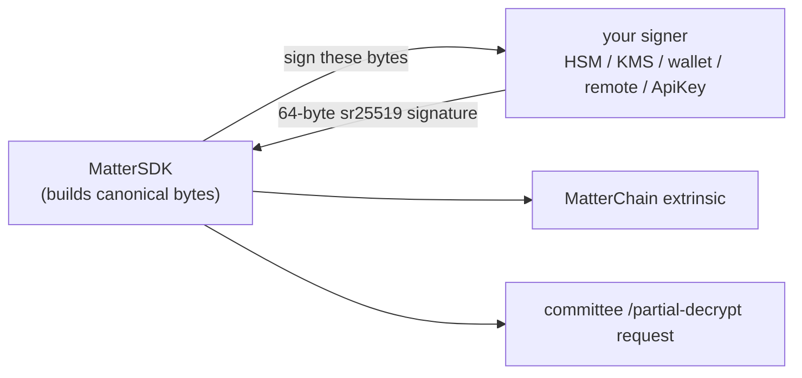

# Secure signing

You decide where your signing key lives. The SDK never needs to hold it: every signature
goes through a seam you can back with an HSM, a cloud KMS, a wallet, or a remote signer.
When a key must live in the process, the `ApiKey` type holds it under guardrails.

| Posture | The key lives | Use it for |
|---|---|---|
| **Bring your own signer** | in your HSM, KMS, wallet, or signing service, never in the SDK's memory | production, and anywhere a key compromise would be expensive. **Recommended.** |
| **`ApiKey`** | in your process, inside a zeroizing, redacting container | CI jobs, agents, ephemeral workers: anything that must build a client from one string |

Both are first-class constructors ([connecting](connecting.md#pick-a-constructor)).

## The seam: signatures, not keys

The SDK builds the canonical bytes to sign, and your signer turns them into a signature:



The committee request bytes come from the shared Rust core, and extrinsic payloads from
each language's chain library, so every language signs exactly what the committee and the
chain verify. One signer covers both uses. Go hands the signer a 32-byte blake2b digest
for extrinsic payloads over 256 bytes, as Substrate specifies.

## Implementing a signer

| Language | Implement | Pass it to |
|---|---|---|
| Rust | `KeySigner`: `scheme()`, `account_id()`, `sign(bytes)` | `MatterClient::connect_with_signer(config, Arc::new(signer))` |
| TypeScript | `KeySigner`: `accountId` and `sign(bytes)`, which may be `async` | `MatterClient.connectWithSigner(signer, config)` |
| Go | `ExtrinsicSigner`: `AccountID()` and `SignExtrinsic(payload)` | `mattersdk.ConnectWithSigner(cfg, signer)` |
| Python | a `substrate-interface` keypair-shaped object whose `sign()` you implement | `MatterClient.connect_with_keypair(keypair)` |

Python's seam takes any keypair-shaped object: it needs `crypto_type`, `public_key`,
`ss58_address` and `sign()`, and `sign()` may call your HSM or remote signer
([parity](parity.md)).

In Rust, this signer is compiled and type-checked by
[`tests/guide_examples.rs`](../crates/matter-sdk/tests/guide_examples.rs):

```rust
use std::sync::Arc;

use matter_sdk::chain::{MatterClient, MatterConfig, Network};
use matter_sdk::{AccountId, KeyError, KeyScheme, KeySigner};

/// An HSM-backed signer: the key never leaves the device.
struct HsmSigner {
    public_key: [u8; 32],
    session: HsmSession, // your PKCS#11 or KMS client
}

impl KeySigner for HsmSigner {
    fn scheme(&self) -> KeyScheme {
        KeyScheme::Sr25519
    }

    fn account_id(&self) -> AccountId {
        AccountId(self.public_key)
    }

    fn sign(&self, message: &[u8]) -> Result<[u8; 64], KeyError> {
        self.session.sign_sr25519(message)
    }
}

async fn connect(signer: HsmSigner) -> matter_sdk::Result<MatterClient> {
    let config = MatterConfig::for_network(Network::Testnet);
    MatterClient::connect_with_signer(config, Arc::new(signer)).await
}
```

```ts
import { MatterClient, type KeySigner } from "@openmatter-network/matter-sdk";

const hsm: KeySigner = {
  accountId: publicKey, // Uint8Array(32)
  sign: async (message) => kms.signSr25519(message), // resolves to Uint8Array(64)
};
const client = await MatterClient.connectWithSigner(hsm);
```

```go
type hsmSigner struct{ publicKey []byte }

func (h hsmSigner) AccountID() []byte { return h.publicKey }
func (h hsmSigner) SignExtrinsic(payload []byte) ([]byte, error) {
	return kms.SignSr25519(payload) // 64 bytes
}

client, err := mattersdk.ConnectWithSigner(mattersdk.Config{}, hsmSigner{publicKey})
```

- **Your signer returns only the 64-byte sr25519 signature.** The SDK adds the SCALE
  `MultiSignature` framing and the account id.
- **`sign` may fail**, and the failure propagates as an error. In Rust, `sign` is
  synchronous so the trait stays object-safe; a signer that does network I/O blocks.
- **Committee requests have their own lower-level seam**, `Signer` (`authorize` returns
  the finished auth fields). Implement it only if you must own the request framing
  yourself. The client's `signer()` (Python and Go) or `keySigner(client.signer)`
  (TypeScript) adapts your chain signer into it for `decrypt`.

### Patterns by key location

| Key lives in | `sign` does |
|---|---|
| HSM (PKCS#11) | calls `C_Sign`; the key is non-exportable |
| Cloud KMS | calls the KMS sign API, or a signing service in an enclave that holds a KMS-sealed sr25519 seed |
| Hardware or browser wallet | triggers the wallet's Substrate signing prompt |
| Remote signing service | makes an authenticated RPC; the key never reaches the app host |

## The `ApiKey` path

An `ApiKey` is a private key your process holds ([formats](keys-and-scopes.md#api-keys)).
Read it from the environment or a secret manager, never from argv or source:

```bash
MATTER_API_KEY=0x…   # the dashboard's key; unset means read-only
```

### What you are trading

Anything that can read your process can read an in-process key: a core dump, a debugger,
a malicious dependency, a crash reporter's heap snapshot. Whoever reads it can act with
it until you revoke it. A signer backed by an HSM or KMS gives a compromised process
*use* of the key only while the compromise lasts, never *possession* of the key. That is
why bring-your-own-signer is the recommendation.

A [scoped key](keys-and-scopes.md#scoped-keys) bounds a leak. A key scoped
`deployments:w` cannot move tokens, stake, vote, read a secret, or mint another key, and
revoking it is one extrinsic that takes effect on the next request.

### The guardrails

Each of these holds in all four languages:

| Guardrail | What it does |
|---|---|
| **Zeroized** | the secret and every intermediate derivation live in zeroizing buffers; no hex or SURI copy is left in freed memory |
| **Redacted** | no formatting path prints the key, even from inside a struct, list or map: `ApiKey(sr25519, 0x…, <redacted>)`, or in Rust `ApiKey { scheme: "sr25519", account: "0x…", material: "<redacted>" }` |
| **Not serializable** | no `Serialize` in Rust; no pickle or copy in Python; Go's `MarshalJSON` returns an error; TypeScript's `toJSON` gives only the redacted form |
| **No secret accessor** | the only outputs are the public account id and signatures; in TypeScript and Go the key never leaves Rust memory |
| **Not clonable** | Rust's `ApiKey` is not `Clone`; share it with `Arc`, so there is one copy to wipe |
| **Errors never echo the key** | a rejection names what is wrong, never any part of the input |
| **No implicit dev account** | a phrase-less URI such as `//Alice` is rejected, so an unset variable cannot become a globally known key |
| **Testnet by default** | a signing client refuses mainnet without [confirmation](connecting.md#the-mainnet-guard) |

These guardrails prevent accidents. They cannot protect a key inside a process an
attacker already controls; that is what an external signer is for.

### Operating an `ApiKey` safely

1. **Scope it narrowly.** Read and write are separate bits. A deployment agent needs
   `deployments:w`, not `deployments:rw`.
2. **Rotate without re-encrypting.** Mint the new key with `keys.authorize`, then revoke
   the old one with `keys.revoke`. Ciphertext is bound to the committee's key, not
   yours. A key with `secrets:w` can grant a secret to itself, and such a grant is an
   ordinary grant on the member's secret. When you retire a key, revoke its `User`
   grants too.
3. **Treat it as a bearer credential.** Keys leak through screenshots, pastes, committed
   `.env` files, and CI jobs that print their environment. Rotate on suspicion, not on
   proof.
4. **Use one key per workload**, so revoking one does not break the others.

## Dev-only local keys

Rust has `Sr25519Signer::from_seed_insecure_dev_only` and `from_uri_insecure_dev_only`
for tests and offline demos. They hold the key in an ordinary buffer, print a warning on
every call, and CI fails any shipped library code that uses them. If a key will live in
your process, put it in an `ApiKey`.

## Secret hygiene

1. **Your signing key is the most valuable secret in the system.** Prefer a signer you
   own.
2. **Recovered plaintext is sensitive.** Keep it short-lived and wipe it
   ([handling plaintext](secrets.md#handling-plaintext)).
3. **Never log secrets.** The SDK never logs plaintext, keys, or signatures, and neither
   should your code.
4. **Seal and recover with the same AAD tag** ([AAD registry](secrets.md#aad-registry)).
5. **Committee requests cannot be replayed.** Each request binds the secret, the
   quorum, a recent finalized block, and the node it is addressed to. The SDK signs once
   per node.

See [`SECURITY.md`](../SECURITY.md) for the threat model.
